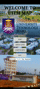

# fsmk-map-mit-app-inventory-version-
simple quick prototype ( USING MIT APP INVENTORY) for my real app fskmmap (using kotlin android studio)

📱 Navigation UiTM Map App – Explore, Learn, and Connect
The Navigation UiTM Map App, developed using MIT App Inventor, is a thoughtfully designed tool aimed at new and current students, visitors, and anyone curious about the Universiti Teknologi MARA (UiTM) experience — with a special spotlight on the UiTM Jasin campus.

Serving both as a navigation assistant and informational hub, this app opens with an inviting home screen that guides users through several key areas:

An introduction to UiTM’s identity as a leading institution in Malaysia

A dedicated section focused on UiTM Jasin, offering insight into its unique campus environment

An interactive campus map, complete with labeled location icons that help users visualize and understand the layout of the entire campus

🧭 Explore UiTM Jasin Like Never Before
The highlight of the app lies in its interactive map, built using a canvas and image sprites. Users can tap on various icons representing key locations across UiTM Jasin — from academic buildings and dormitories to recreational spaces like the futsal court and the scenic lake.

Each tap reveals a popup-style info card containing:

A brief description of the place

A photo of the location

A button to explore the place further through a dedicated screen

Whether you want to find the canteen selling roti canai and nasi goreng, the Kolej Tun Gemala dormitories for female students, the Agrotechnology farm, or even the campus clinic, everything is just a tap away.

🌟 Features
✅ Clean and beginner-friendly interface

🗺️ Accurate layout of UiTM Jasin’s real map using canvas and markers

📸 Camera-based “Human Verification” popup with a friendly greeting

🔄 Real-time student photo review (Firebase-ready)

📚 Informational content about UiTM as a whole and its mission

🎵 Optional background music and immersive design

🎯 Purpose
This app isn’t just for navigation — it’s a welcoming bridge for new students, an exploration tool for guests, and a resource for understanding UiTM Jasin’s full ecosystem. It helps you feel connected to the campus before you even step foot on it.

Whether you’re a curious student, a proud alumni, or just someone exploring the UiTM system, the Navigation UiTM Map App is your gateway to learning, locating, and experiencing the full life of UiTM Jasin — all in the palm of your hand.
 
 
 🌟 DEMO

